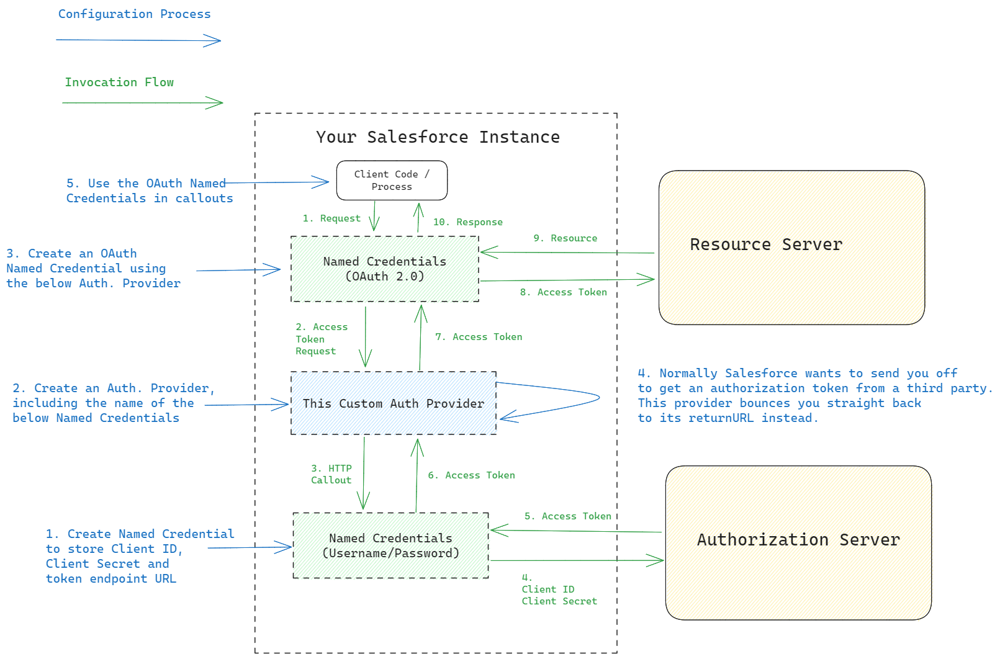

# OAuth Client Credentials Auth Provider Plugin for Salesforce

## Overview

Salesforce's out-of-the-box support for OAuth clients is limited to [Authorization Code Grant](https://datatracker.ietf.org/doc/html/rfc6749#section-4.1). If you want to use [Client Credentials Grant](https://datatracker.ietf.org/doc/html/rfc6749#section-4.4) (system to system, as opposed to redirecting a browser session), you're on your own and you need an Auth Provider Plugin.

If you google this, there are several guides on building one as well as open source implementations. But they all store the Client ID and Client Secret in the Custom Metadata for the Auth Provider - That's a paddlin'.

This implementation uses a second set of Named Credentials to store the Client ID and Secret, which is best practise on the Salesforce Platform.

Here's a diagram:

## Setup Process

Step 1: Install the OAuthClientCredentialsAuthProvider apex class and Client_Credentials_OAuth__mdt custom metadata type in your Salesforce instance. You can use the Deploy button at the top, or the sfdx cli to do this.

Step 2: Create a Named Credential to hold your Client Credentials.
Configure it as follows (use Legacy):
Label: A label describing what the client credentials are for, ideally should mention the Authorization Server (e.g. "Okta Client Credentials")
Name: As above, but a short name. Copy this for the next step.
URL: The URL of the Authorization Server's token endpoint
Identity Type: Named Principal
Authentication Protocol: Password Authentication
Username: Your Client ID
Password: Your Client Secret
Generate Authorization Header: Yes
Allow Merge Fields in HTTP Header: No
Allow Merge Fields in HTTP Body: No

Step 3: Create an Auth Provider
Configure it as follows:
Provider Type: OAuthClientCredentialsAuthProvider (if it's not in the list, you haven't deployed the Apex class correctly)
Name: A name describing the Authorization Server (e.g. "Okta")
URL Suffix: Any valid suffix, feel free to use the same as the Name
URL Suffix (again): the same suffix as above, we use this inside the plugin code
Named Credentials Name: the name of the named credentials you created in Step 2
OAuth scopes: Configure as per your Authorization server
Include Consumer Secret in SOAP API Responses: No
Execute Registration As: Pick a user

Step 4: Create another Named Credential
Configure it as follows (use Legacy):
Label: A label describing the Resource Server (the system you need the access token for)
Name: As above, but a short name
URL: The URL of the server you need to access
Identity Type: Named Principal
Authentication Protocol: OAuth 2.0
Authentication Provider: The Auth Provider you created in Step 3
OAuth scope: Configure as required
Start Authentication Flow on Save: Yes
Generate Authorization Header: Yes
Allow Merge Fields in HTTP Header: No
Allow Merge Fields in HTTP Body: No

When you click save, you'll get redirected back to the same screen. 
Hopefully the Authentication Status has changed to a success message. If not, Salesforce does not always relay the failures back to the browser. If you want to dig further into the response, try uncommenting the debug statement in the getAccessToken method of OAuthClientCredentialsAuthProvider.

Step 5: Use the Named Credential
Whenever you need to access an external resource, you can do a callout using the Named Credential from Step 5.

# Getting Started with Salesforce Developer Experience (DX)

## Configure Your Salesforce DX Project

The `sfdx-project.json` file contains useful configuration information for your project. See [Salesforce DX Project Configuration](https://developer.salesforce.com/docs/atlas.en-us.sfdx_dev.meta/sfdx_dev/sfdx_dev_ws_config.htm) in the _Salesforce DX Developer Guide_ for details about this file.

## Read All About It

- [Salesforce Extensions Documentation](https://developer.salesforce.com/tools/vscode/)
- [Salesforce CLI Setup Guide](https://developer.salesforce.com/docs/atlas.en-us.sfdx_setup.meta/sfdx_setup/sfdx_setup_intro.htm)
- [Salesforce DX Developer Guide](https://developer.salesforce.com/docs/atlas.en-us.sfdx_dev.meta/sfdx_dev/sfdx_dev_intro.htm)
- [Salesforce CLI Command Reference](https://developer.salesforce.com/docs/atlas.en-us.sfdx_cli_reference.meta/sfdx_cli_reference/cli_reference.htm)
